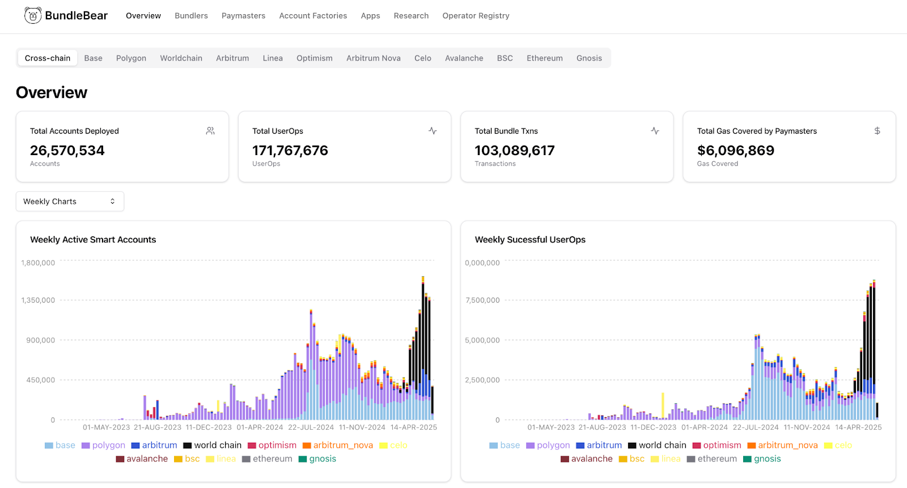

---
title: Superchain 4337 dataset explained
description: Explains the creation and usage of the Optimism Superchain 4337 dataset, including its role in retrofunding, available BigQuery tables for UserOps and EntryPoint traces, address labeling efforts, and example applications like BundleBear and Patterns.
sidebar_position: 3
---

# Superchain 4337 dataset explained

## Background

Optimism Foundation manages the development of the Optimism Superchain which now consists of +20 networks and runs multiple processes responsible for fair distribution of funds amongst the most engaged web3 projects operating in the ecosystem. Retrofunding (“RPGF”) is one of such processes, where OP stakeholders adjust grants to projects based on their value added to the ecosystem.

Being aware of the fact that ERC4337 standard created by the Ethereum Foundation team is a UX-breakthrough for both web3 dApps and their users, the aim of creating the dataset explained in this article was to include 4337-related metrics in the RPGF process, as well as, make these metrics easily available to all stakeholders that could make use of it.

The creation of this dataset was possible thanks to the Optimism Foundation grant and cooperation between multiple projects - including [Optimism Foundation](http://optimism.io), [Account Abstraction Team](https://www.erc4337.io/), [Open Source Observer](https://opensource.observer), [BundleBear](https://www.bundlebear.com/), [Patterns](https://patterns.build/) and many others.

## SQL databases

In order to make OP Supechain data more accessible for developers and projects, Optimism maintains two Google BigQuery datasets that aggregate all historical data coming from the Superchain ecosystem. Both sets are accessible for free and have around 24 hours of latency.

### Raw Onchain Data

Contains raw data from all OP Superchain networks, including traces. The data is collected through an indexation model created and maintained by OP Foundation. [You can subscribe to the dataset and access it here](https://console.cloud.google.com/bigquery/analytics-hub/exchanges/projects/523274563936/locations/us/dataExchanges/optimism_192d403716e/listings/optimism_superchain_raw_onchain_data_192fdc72e35?invt=Abu1NA&project=kamilgorskiproject1).

### ERC-4337 (Account Abstraction) Data

OP Labs maintains account abstraction datasets for superchain chains. [You can subscribe to the dataset and access it here.](https://console.cloud.google.com/bigquery/analytics-hub/exchanges/projects/523274563936/locations/us/dataExchanges/optimism_192d403716e/listings/optimism_superchain_4337_account_abstraction_data_1954d8919e1?invt=Abu1Ng&project=kamilgorskiproject1) This includes the 2 following tables:

-   useroperationevent_logs_v2: Decoded UserOperationEvent logs.
-   enriched_entrypoint_traces_v2: Decoded innerHandleOp traces joined with UserOperationEvent logs.
    

Let’s go through these tables and see what queries we can generate!

#### Table: useroperationevent_logs_v2

OP Labs maintains account abstraction datasets for superchain chains. This includes the following columns:

-   dt (DATE): Day of event in the ‘YYYY-MM-DD’ form, eg. 2025-04-03
-   chain (VARCHAR): The official name of the network according to the above list.
- chain_id (INTEGER): Represents the id of chain inside the Superchain ecosystem:
--   10 - op
--   1135 - lisk 
--   130 - unichain
--   1868 - soneium
--   252 - fraxtal
--   34443 - mode
--   360 - shape
--   480 - worldchain
--   57073 - ink
--   60808 - bob
--   6805 - race
--   7777777 - zora
--   8008 - polynomial
--   8453 - base
--   957 - lyra    
-   network (VARCHAR): Type of the network - either testnet or mainnet.
-   block_timestamp (UINTEGER): Block timestamp, eg. 1743642909
-   block_number (BIGINT): Number of the block
-   block_hash (VARCHAR): Hash of the block
-   transaction_hash (VARCHAR): Hash of the transaction
-   transaction_index (BIGINT): Transaction index within the block
-   log_index (BIGINT): Index of the emitted UserOperationEvenet log
-   contract_address (VARCHAR): ERC-4337 Entry point contract address.
-   sender (VARCHAR): Smart contract wallet that sent out the UserOp
-   paymaster (VARCHAR): Address of the Paymaster contract, 0x0000000000000000000000000000000000000000 if no Paymaster was used.
-   nonce (VARCHAR): TX nonce
-   success (BOOLEAN): True if TX passed, false if reverted
-   actualGasCost (VARCHAR): Current gas cost
-   actualGasUsed (VARCHAR): Actual gas used for the UserOp
    

  

#### Table: enriched_entrypoint_traces_v2

The innerHandleOp traces are decoded and joined to the useroperationevent_logs table. This result is then self-joined back to the entrypoint contract traces which result in enrichment of all traces with the corresponding fields from the innerHandleOp and the emitted UserOperationEvent. The self join applies only to traces that are subtraces of the innerHandleOp.

Only traces that are subtraces of an innerHandleOp are kept in the table. Below we show an example.

-   dt (DATE): Day of event in the ‘YYYY-MM-DD’ form, eg. 2025-04-03
-   chain (VARCHAR): Type of the network - either testnet or mainnet.
-   chain_id (INTEGER): Represents the id of chain inside the Superchain ecosystem:
--   10 - op
--   1135 - lisk
--   130 - unichain
--   1868 - soneium
--   252 - fraxtal
--   34443 - mode
--   360 - shape
--   480 - worldchain
--   57073 - ink
--   60808 - bob
--   6805 - race
--   7777777 - zora
--   8008 - polynomial
--   8453 - base
--   957 - lyra
-   network (VARCHAR): Either testnet or mainnet.
-   block_timestamp (UINTEGER): Block timestamp, eg. 1743642909
-   block_number (BIGINT): Number of the block, eg. 12153635
-   block_hash (VARCHAR): Hash of the block
-   transaction_hash (VARCHAR): Hash of the transaction
-   transaction_index (BIGINT): Transaction index within the block
-   from_address (VARCHAR): Sender of the transaction.
-   to_address (VARCHAR): Recipient of the transaction.
-   value (VARCHAR): Value of the transaction.
-   input (VARCHAR): Transaction input value.
-   output (VARCHAR): Transaction output value.
-   trace_type (VARCHAR): Call, create or create2.
-   call_type (VARCHAR): Call, delegatecall or staticcall.
-   reward_type (VARCHAR): Deprecated field.
-   gas (BIGINT): Amount of gas reserved for transaction.
-   gas_used (BIGINT): Amount of gas used.
-   subtraces (BIGINT): Number of subtraces to the transaction.
-   trace_address (VARCHAR): Trace internal call address.
-   error (VARCHAR): Error output if any.
-   status (BIGINT): Status of the transaction.
-   trace_root (INTEGER): The root of the trace address (number before the first comma), for example:
--   # "" -> -1
--   # "0" -> 0
--   # "0,2" -> 0
--   # "0,10,0" -> 0
--   # "0,100,0" -> 0
-   method_id (VARCHAR): Contract method called by the transaction.
-   tx_from_address (VARCHAR): The from_address of the parent transaction (caller to the EntryPoint contract).
-   bundler_address (VARCHAR): Bundler processing the transaction.
-   entrypoint_contract_address (VARCHAR): EntryPoint contract address.
-   entrypoint_contract_version (VARCHAR): EntryPoint contract version.
-   innerhandleop_trace_address (VARCHAR): Trace address of the innerHandleOp call.
-   is_innerhandleop (BOOLEAN): This value is true for traces that are innerHandleOp and false for their child traces.
-   is_from_sender (BOOLEAN): True if this is a trace where the trace from_address matches the userOp sender address. This allows narrowing down calls that are executed on behalf of the sender.
-   userop_sender (VARCHAR): The sender of the UserOp.
-   userop_paymaster (VARCHAR): Paymaster paying for the UserOp, 0x0000000000000000000000000000000000000000 if none was used.
-   userop_hash (VARCHAR): Hash of the UserOp.
-   userop_calldata (VARCHAR): Calldata within the UserOp.
-   innerhandleop_decodeerror (VARCHAR): Convenience field for debugging.
-   innerhandleop_opinfo (VARCHAR): Convenience field for debugging.
-   innerhandleop_context (VARCHAR): Convenience field for debugging.
-   useropevent_nonce (VARCHAR): Nonce of the UserOp.
-   useropevent_success (BOOLEAN): True if UserOp succeeded, fail if failed.
-   useropevent_actualgascost (VARCHAR): Gas reserved for the UserOp.
-   useropevent_actualgasused (VARCHAR): Actual gas used for the UserOp.
-   userop_idx (BIGINT): The row_number() of traces where from_address = sender ordered by trace_addres. This is equal to 1 for the userOp call.
-   useropevent_actualgascost_eth (DOUBLE): Actual gas cost converted to double for convenience.
    

  

## Labelled on-chain adresses

In order to decode Account Abstraction data and generate human-readable insights from metrics, one needs to be able to identify multiple on-chain entities playing their role in the ERC-4337 Standard. According to Account Abstraction Documentation, we can identify the following on-chain categories:

-   Smart Contract Wallets
-   Wallet Factories
-   Bundlers
-   Paymasters
-   dApps
    
[BundleBear](https://www.bundlebear.com/) has created an open-source catalogue of known on-chain addresses on the Optimism Network in order to decode collected 4337 data. The labels can be accessed in its repository under the following address:

[https://github.com/Jam516/BundleBear/tree/main/models/erc4337/labels](https://github.com/Jam516/BundleBear/tree/main/models/erc4337/labels)

These addresses were added and are available in the [Open Label Initiative](https://www.openlabelsinitiative.org/) project to help fellow builders create dashboards and discover new use-cases for the 4337 data.

## How is the 4337 dataset utilized?

The datasets described above are then joined together and used for multiple use-cases, some of which include:

### [Optimism Retrofunding](https://atlas.optimism.io/)
A mechanism where OP Ecosystem projects are being algorithmically assessed for their value added into the ecosystem. The assessments happen in monthly periods and include a variety of off and on-chain metrics, depending on the type of project. Assessment algorithms are designed by [Open Source Observer](https://www.opensource.observer/) and for on-chain projects the [Goldilocks algorithm is currently used](https://snapshot.box/#/s:retrofunding.eth/proposal/0x23f8cc1791835acaf60c49208a6cb3502f789380b1ad0a60cef878be03a98d0d) with the following metrics:
-   TVL (25%)
-   Monthly active users (25%)
-   Transactions (25%)
-   Gas fees (25%)
  
4337 metrics are included in the last two categories:
-   The number of successful UserOps is included in the Transactions metric as per this OSO model.
-   Gas fees covered by 4337-based Paymaster smart contracts are included in the gas fees metrics as per this OSO model.

Exact source code of Goldilock and other models [designed by OSO can be found in the OP Github repository](https://github.com/ethereum-optimism/Retro-Funding).

### [BundleBear](https://www.bundlebear.com/) 
A 4337 analytics platform showcasing the latest trends and most important metrics on Account Abstraction adoption on multiple networks. BundleBear displays data on all 4337 entities, including:

-   Bundlers
-   Paymasters
-   Account factories
-   Apps
-   Operator Registry
   

### [Open Label Initiative](https://www.openlabelsinitiative.org/)
An open-source platform collecting attestations on known on-chain addresses. They assign a specific category to every new address according to a predefined model that is being constantly developed. [The category definitions](https://github.com/openlabelsinitiative/OLI/blob/main/1_data_model/tags/valuesets/category_definitions.yml) include:
-   CeFi
-   DeFi
-   NFT
-   Social
-   Types of transfers
-   Utility
-   Cross-chain
   
### [Patterns](https://patterns.build/) 
A tool for web3 builders to track and manage their on-chain users and conversions. Patterns is currently working on an open-source Paymaster Management App, that will allow web3 builders to easily create and manage their Paymaster policies in order to improve adoption and user experience of their products.
